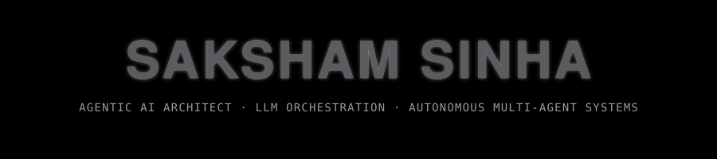

<div align="center">




</div>

<br>

## 👋 Who Am I

`about.yaml`

```yaml
role: Agentic AI Architect & LLM Orchestration Engineer

about: >
  Computer Science undergraduate specializing in Agentic AI, LLM orchestration,
  and autonomous multi-agent architectures. My work focuses on building robust
  workflows that turn raw model intelligence into deterministic, goal-driven
  systems — from dynamic tool-calling pipelines to multi-agent reasoning loops.

currently_building: >
  A multi agentic architecture project envolving fine-tuned multiple end-to-end
  deployed agents. Major project: "EEG based Motor Imagery classification" —
  decodes human brain signals, recorded during the mental imagination of a
  physical movement, into specific computer commands for Brain-Computer
  Interfaces (BCIs).

previously: >
  DalalStreet AI — a quantitative platform delivering real-time trend
  forecasting and automated risk assessment architectures for financial
  markets.

driven_by: >
  Rapid execution, AI-driven development workflows, and pushing the
  boundaries of autonomous systems.
```

<br>

## 🎯 `focus_areas`

<div align="center">

|  |  |  |
|:---:|:---:|:---:|
| 🤖 &nbsp;Agentic AI | 🔄 &nbsp;Autonomous Workflows | 🧠 &nbsp;LLM Orchestration |
| 📈 &nbsp;Quantitative Systems | 🧪 &nbsp;Agentic Eval | 🚪 &nbsp;LLM Gateways |

</div>

## 🏗️ `architecture_experience`

```
▸ Designing deterministic agent loops
▸ Multi-agent collaboration frameworks
▸ Tool-use protocols
▸ Structured reasoning pipelines
```

<br>

## 🛠️ `tech_stack`

<div align="center">


<br><br>


</div>

<br>

## 📊 `analytics`

<div align="center">

<picture>
  <source media="(prefers-color-scheme: dark)" srcset="https://github-readme-stats.vercel.app/api?username=Saksham-s-2024&show_icons=true&hide_border=true&bg_color=0D1117&title_color=F5A623&icon_color=F5A623&text_color=c9d1d9&count_private=true">
  <source media="(prefers-color-scheme: light)" srcset="https://github-readme-stats.vercel.app/api?username=Saksham-s-2024&show_icons=true&hide_border=true&bg_color=FFFFFF&title_color=B8860B&icon_color=B8860B&text_color=24292e&count_private=true">
  
</picture>
<picture>
  <source media="(prefers-color-scheme: dark)" srcset="https://github-readme-stats.vercel.app/api/top-langs/?username=Saksham-s-2024&layout=compact&hide_border=true&bg_color=0D1117&title_color=F5A623&text_color=c9d1d9">
  <source media="(prefers-color-scheme: light)" srcset="https://github-readme-stats.vercel.app/api/top-langs/?username=Saksham-s-2024&layout=compact&hide_border=true&bg_color=FFFFFF&title_color=B8860B&text_color=24292e">
  
</picture>

<picture>
  <source media="(prefers-color-scheme: dark)" srcset="https://streak-stats.demolab.com/?user=Saksham-s-2024&hide_border=true&background=0D1117&ring=F5A623&fire=F5A623&currStreakLabel=F5A623&sideLabels=c9d1d9&currStreakNum=e6edf3&sideNums=e6edf3&dates=8b949e">
  <source media="(prefers-color-scheme: light)" srcset="https://streak-stats.demolab.com/?user=Saksham-s-2024&hide_border=true&background=FFFFFF&ring=B8860B&fire=B8860B&currStreakLabel=B8860B&sideLabels=24292e&currStreakNum=1f2328&sideNums=1f2328&dates=57606a">
  
</picture>

<picture>
  <source media="(prefers-color-scheme: dark)" srcset="https://github-readme-activity-graph.vercel.app/graph?username=Saksham-s-2024&bg_color=0D1117&color=F5A623&line=F5A623&point=E6EDF3&area=true&area_color=F5A623&hide_border=true">
  <source media="(prefers-color-scheme: light)" srcset="https://github-readme-activity-graph.vercel.app/graph?username=Saksham-s-2024&bg_color=FFFFFF&color=B8860B&line=B8860B&point=1F2328&area=true&area_color=B8860B&hide_border=true">
  
</picture>

</div>

## 🏆 `trophies`

<div align="center">

<picture>
  <source media="(prefers-color-scheme: dark)" srcset="https://github-profile-trophy.vercel.app/?username=Saksham-s-2024&theme=flat&no-frame=true&row=1&column=6&title-color=F5A623&icon-color=F5A623&text-color=c9d1d9&background=0D1117">
  <source media="(prefers-color-scheme: light)" srcset="https://github-profile-trophy.vercel.app/?username=Saksham-s-2024&theme=flat&no-frame=true&row=1&column=6&title-color=B8860B&icon-color=B8860B&text-color=24292e&background=FFFFFF">
  
</picture>

</div>

## 🐍 `contribution_graph`

<div align="center">

<picture>
  <source media="(prefers-color-scheme: dark)" srcset="https://raw.githubusercontent.com/Saksham-s-2024/Saksham-s-2024/output/github-contribution-grid-snake-dark.svg">
  <source media="(prefers-color-scheme: light)" srcset="https://raw.githubusercontent.com/Saksham-s-2024/Saksham-s-2024/output/github-contribution-grid-snake.svg">
  
</picture>

<sub>✨ powered by <a href="https://github.com/Platane/snk">Platane/snk</a> — activates once the matching GitHub Action is added to this repo.</sub>

</div>

<br>

## 🌐 `connect`

<div align="center">

[](https://www.linkedin.com/in/saksham-sinha-a28968282)
[](mailto:saksham2106.sinha@gmail.com)

</div>

<picture>
  <source media="(prefers-color-scheme: dark)" srcset="https://capsule-render.vercel.app/api?type=waving&color=0:0d1117,50:1a140b,100:0d1117&height=120&section=footer">
  <source media="(prefers-color-scheme: light)" srcset="https://capsule-render.vercel.app/api?type=waving&color=0:ffffff,50:fff3d6,100:ffffff&height=120&section=footer">
  
</picture>

<div align="center"><sub>Originally created with <a href="https://gprm.itsvg.in">GPRM</a></sub></div>
